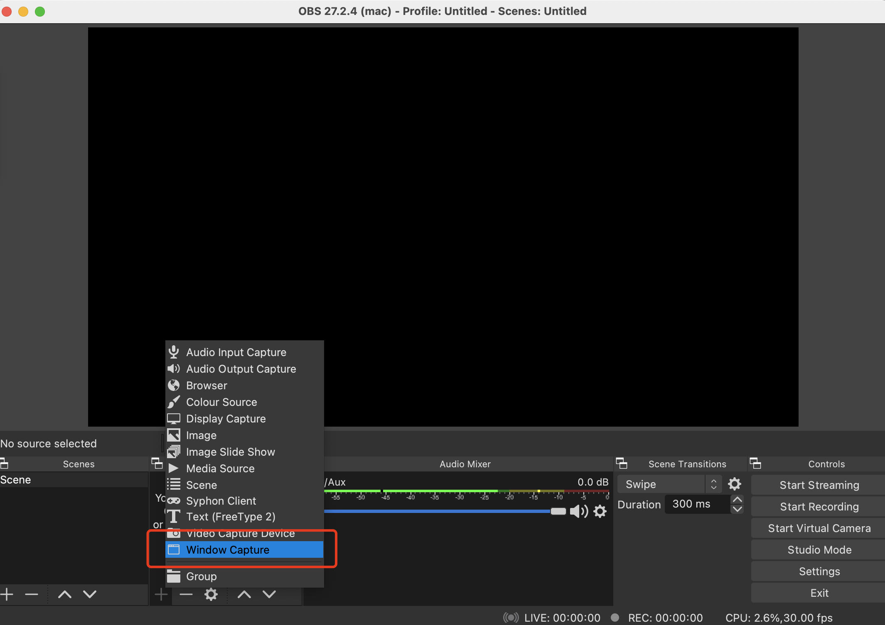
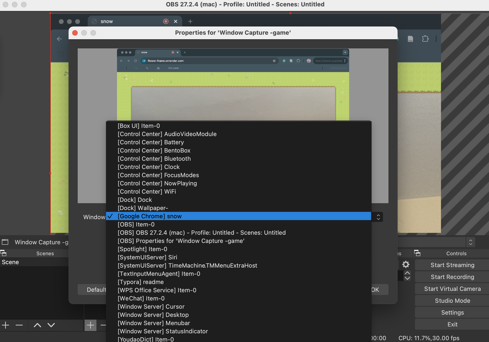
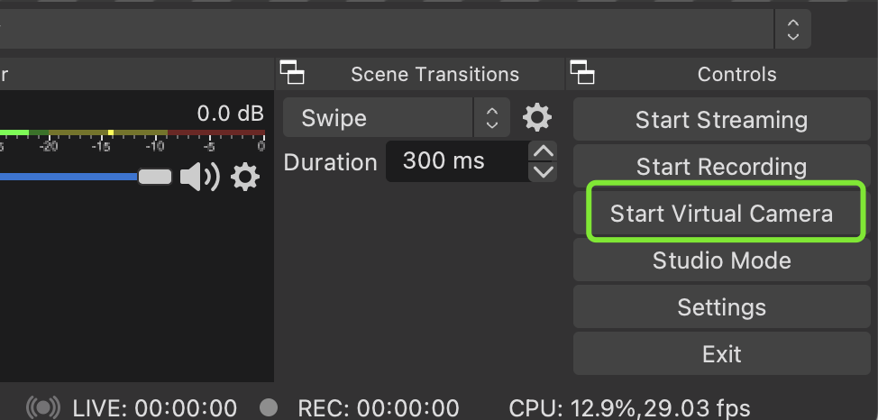
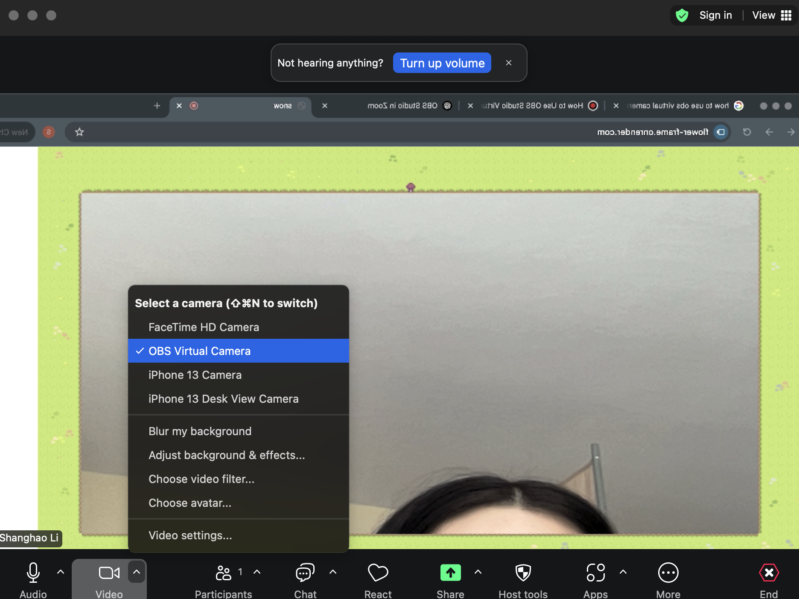

# Exertion games for online meeting 

This repository includes all the games designed and developed as part of our research presented in *"BIG-AOME: Designing Bodily Interaction Gamification towards Anti-sedentary Online Meeting Environments."* **BIG-AOME** explores the design of gamified bodily interactions to mitigate sedentary behavior during online meetings. This repository hosts the codebase and documentation for high-fidelity prototypes developed and evaluated in our research study.

**Project Goals**

- Reduce prolonged sedentary behavior in online meetings
- Design enjoyable and lightweight games that encourage movement
- Seamlessly integrate physical activity into everyday virtual conferencing environments

This repository includes **five exertion-based games** designed to be used in online meetings to promote movement and engagement:

- **Food Rain** – A game where players move their head and neck and open their mouth to catch falling food items.
- **Flower Frame** – A reactive camera frame that grows flowers when you stand up and hold your position.
- **Frost** – A game that prompts gentle neck movements to clear virtual frost from the video window, supporting subtle in-meeting activity.
- **Virus-hitter**:  A cooperative game where participants use seated torso and head movements to collaboratively destroy virtual virus towers

## How to use it

### **Step 1: Access the Games**

The games are deployed on Render. You can access them using the links below:

- **Food Rain**: https://food-rain.onrender.com
- **Flower Frame**: https://flower-frame.onrender.com
- **Frost:** https://frost-0h2u.onrender.com
- **Virtus hitter**: https://virus-hitter.onrender.com

Open the game you'd like to play in your web browser.

###  Step 2: Set Up OBS Virtual Camera for Zoom

Use OBS Studio to share the game in Zoom by following these steps:

1. **Add a Window Capture Source**

   Open OBS Studio and click **+** under the *Sources* panel to add a new **Window Capture** source.

2. **Select the Game Window**

   Choose the browser window where the game is running.

3. **Start Virtual Camera**

   Click the **Start Virtual Camera** button in OBS.

4. **Switch to OBS Camera in Zoom**

   In your Zoom meeting, go to **Video Settings** → **Select Camera** → choose **OBS Virtual Camera**.

## Notes

### Deployment 

Our games are deployed using Render’s free plan, which offers 512 MB RAM, 0.1 CPU, and 750 free instance hours per month.  If usage exceeds this limit, the games may become temporarily unavailable until the next month.

You can deploy the games yourself on Render with a paid plan for more reliable access.
 👉 **How to deploy:**

**For games with a backend (e.g., Food Rain):**

1. Fork this GitHub repo
2. On https://dashboard.render.com, click **“New +” → “Web Service”**
3. Set the **Root Directory** to the game folder (e.g., `food-rain`)
4. Set **Build Command** to `npm install`
5. Set **Start Command** to `node server.js` (or your actual entry point)
6. Choose a plan and deploy

**For static games (e.g., Flower Frame):**

1. Click **“New +” → “Static Site”**
2. Set the **Root Directory** to `flower-frame`
3. Leave **Build Command** blank
4. Set **Publish Directory** to `.`
5. Deploy — Render will serve `index.html` automatically

### Cite this work

Please cite as:

Jiang J, Li S, Li X, Xu Y, Zhao J, An P

BIG-AOME: Designing Bodily Interaction Gamification towards Anti-sedentary Online Meeting Environments

JMIR Serious Games. 27/01/2025:62778 (forthcoming/in press)

DOI: [10.2196/62778](https://doi.org/10.2196/62778)

URL: https://preprints.jmir.org/preprint/62778

